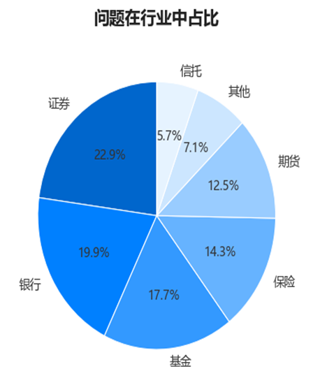
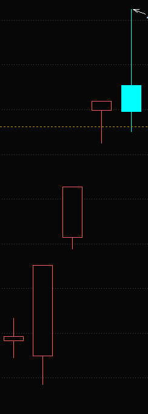
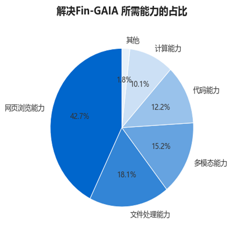
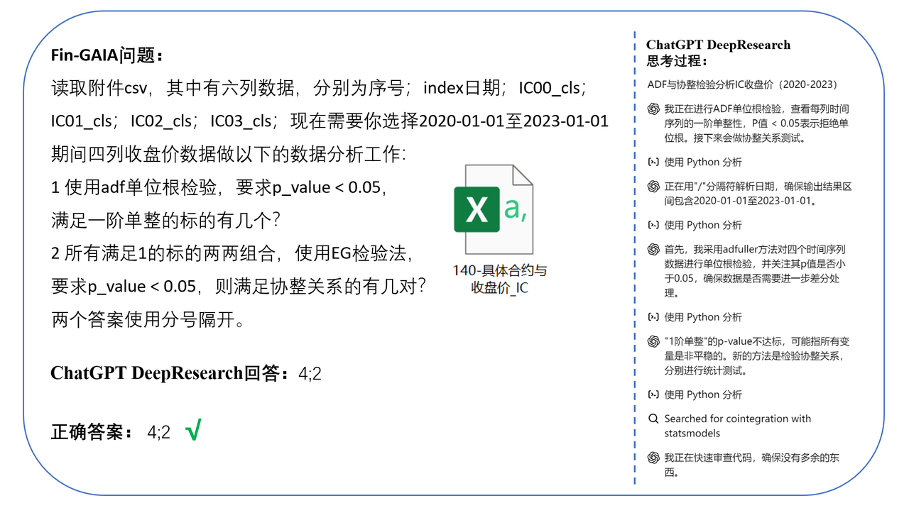
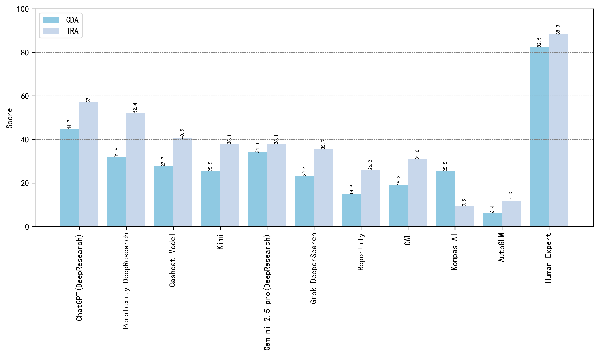
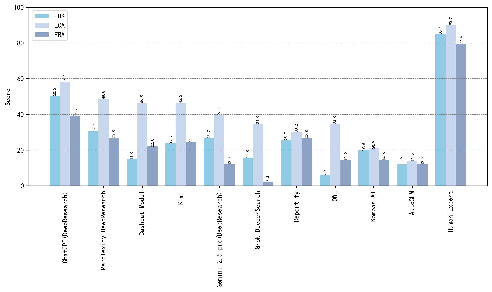

<div align="center">
   <h1>FinGAIA: 首个金融领域AI智能体评测基准</h1>
  
<!-- 徽章部分 -->
                                                                                                                 

<!-- 论文链接 -->
   [📃论文](https://arxiv.org/abs/2507.17186)
<!-- 数据链接 -->
   [🌐数据](https://drive.google.com/drive/folders/1JmCCZKEveFKmEOBRzNF2RL7hdDnJd4Ob?usp=sharing)

<!-- 语言切换链接 -->
   [简体中文](./README.md) | [English](./README_EN.md) 
</div>


AI Agent的蓬勃发展为自动化各个领域的复杂任务带来了前所未有的机遇，但其在金融领域里的多步骤、多工具协作能力尚未得到探索。本文介绍了 FinGAIA ,首个专门为金融场景量身定制的端到端Agent评估基准, 弥补了当前工作的空白并为推动金融AI Agent的发展打下了坚实基础。FinGAIA 以高度还原的金融业务场景为设计核心，全面覆盖从基础业务理解到复杂策略制定的各类任务，共包含407道在金融领域专家指导下完全人工编写的题目，涵盖证券、基金、银行、保险、期货、信托和资产管理七个主要金融子领域，并按三个层次化的场景深度组织：基础业务分析、资产决策支持、战略风控管理，聚焦评估智能体在金融语境理解、数据整合分析、工具协同调用与多步骤推理等方面的综合能力，系统性衡量智能体在真实金融业务流程中的任务执行能力与专业表现。我们在零样本设置下评测了12个当前主流的AI Agent。表现最优的Agent ChatGPT 总体准确率为48.9%，虽优于非专业人士，但仍落后金融专家 35 个百分点以上。

---
# 📌 目录<a name="toc"></a>
## FinGAIA
- [为什么需要Fin-GAIA](#why)
- [场景应用](#application)
  - [客户数据分析](#客户数据分析)
  - [交易风险评估](#交易风险评估)
  - [金融数据统计](#金融数据统计)
  - [贷款信用分析](#贷款信用分析)
  - [欺诈检测分析](#欺诈检测分析)
  - [风险管理分析](#风险管理分析)
  - [投资组合资金分配](#投资组合资金分配)
  - [市场趋势预测](#市场趋势预测)
## 性能评估
- [核心能力考察](#核心能力考察)
- [排行榜](#排行榜)
## 使用说明
- [未来展望](#future)
- [联系我们](#connection)
- [引用](#cite)


## FinGAIA
### 💡 为什么需要FinGAIA <a name="why"></a> 
长期以来，对AI的评估多局限于孤立的知识问答，这难以反映其在金融行业实际工作中的应用潜力。金融业务的复杂性在于，它并非一次简单的问答，而是一个涉及“**信息获取、数据处理、分析推理、决策判断**”的完整闭环。现有的评测基准存在明显局限：
* **通用智能体基准的领域特异性缺失**：如GAIA、AgentBench等主流基准，缺乏对金融领域专业性、数据动态性和强合规约束的考量。
* **金融领域基准的任务单一性局限**：如Fin-Eval、FinQA等，多局限于问答、知识理解等基础层面，难以测试AI在真实金融工作流中的复杂多步骤规划与工具协同能力。
* **端到端代理框架评估的缺位**：现有研究多侧重于底层大模型或单一插件的性能，缺乏对完整AI Agent框架在业务流程中整体表现的系统性评估。
为应对这些挑战，Fin-GAIA设计构建了三级分层的能力评测体系，涵盖三个难度等级与八个典型金融业务场景，分别对应智能体在基础理解、分析决策、战略推理等层次的能力要求。

### 🔬 场景应用 <a name="application"></a> 
FinGAIA共包含407个任务，涵盖了证券、基金、银行、保险、期货、信托和资产管理七个主要金融子领域，以确保评测的全面性。这些任务根据金融领域专家的广泛讨论设计，并基于真实世界的金融数据构建，经过专业筛选和结构化处理，以确保其真实性、相关性和评估效用 。
<div align="left">
  
  <br />
  <br /></div>

| Scenario Depth        | Financial Scenario                  | Questions |
|-----------------------|-------------------------------------|-----------|
| Operational Analytics |   Customer Data Analytics           | 47        |
|                       |   Transaction Risk Assessment       | 42        |
|                       |   All                               | 89        |
| Asset Decision        |   Financial Data Statistics         | 101       |
|                       |   Loan Credit Analysis              | 43        |
|                       |   Fraud Detection Analysis          | 41        |
|                       |   All                               | 185       |
| Strategic Risk        |   Risk Management Analysis          | 42        |
|                       |   Portfolio Fund Allocation         | 40        |
|                       |   Market Trend Forecasting          | 51        |
|                       |   All                               | 133       |
| **FinGAIA**           | **All**                             | **407**   |

我们采用分层评估框架，将任务划分为基础业务分析、资产决策支持、战略风控管理，分别对应不同的认知复杂度和操作要求 。
Level 1：基础业务分析层，着重评估智能体对金融基础知识、多模态金融信息的处理能力；
Level 2：资产决策支持层，聚焦对中等复杂度任务的信息整合、逻辑推理与工具使用；
Level 3：战略风控管理层，面向高复杂度、多工具协同与策略规划任务，全面考察模型在真实金融语境下的推理能力与专业性。   (金融子领域+八大场景示例)

#### 客户数据分析
客户数据分析主要通过审查客户信息来了解其数据。这项工作的核心是识别模式和洞察力，从而为有针对性的市场营销策略、产品开发和个性化客户体验提供信息。通过此分析，金融机构能够优化其产品并建立更牢固的客户关系。以下是客户数据分析的任务示例：
<div align="center">
  
  <br />
  <br /></div>

```text
问题：识别附件中的图片，这是一家期货公司的图标。访问其官网。在"营业机构模块"搜索：河北省沧州市营业网点的负责人是谁？
答案：冷俊杰
解题步骤：1、识别附件图片 2、辨别图片为中信建投期货图标 3、访问官网 4、进入营业机构模块 5、筛选目标信息 6、查找负责人名称。
```

#### 交易风险评估
交易风险评估侧重于识别和评估与金融交易相关的潜在风险。这包括分析违约、欺诈或其他财务损失的可能性。这项工作旨在通过实施适当的控制措施和对交易审批做出明智的决策来降低风险。
<div align="center">
  
  <br />
  <br /></div>

```text
问题：小明有一张截图关于期货交易管理条例（2017年修订）得部分内容，但是由于部分内容被遮挡，他想知道被遮挡得内容是什么？你可以在中国期货业协会官网找到相关文件。
答案：为期货交易提供集中履约担保
解题步骤：1、搜索基金 维基百科 2、点击进入官网 3、点击历史版本 4、查找2014 年 3 月 3 日点击 5、找到对应第四个基金类别：证券投资基金 6、点击进入词条 7、点击历史版本 8、确认时间 9、查看按投资标的分为几类，发现分为8类。
```

#### 金融数据统计
金融数据统计涉及收集、整理和解释数字金融信息。主要任务是利用统计方法从大型数据集中得出有意义的见解和趋势。这项工作为报告、预测和识别金融业务中的异常情况提供支持。
<div align="center">
  
  <br />
  <br /></div>

```text
问题：附件中是某个德国保险公司的标志，在其官网上有2024年9月停售的“XX安享稳盈终身寿险”（XX为公司名称），通过python读取该产品费率表数据，计算该表中每一列数据（年龄列不参与计算）的变异系数（标准差 / 均值），告诉我变异系数从大到小，排名第三的是哪一列数据，回答格式如：保险类型A型；男性；趸交。
答案：保险类型B型；男性；趸交
解题步骤：1、查看图片，发现是安联人寿 2、搜索安联人寿 3、点击进入官网 4、点击信息披露-产品基本信息 5、点击停售 6、搜索“安联安享稳盈终身寿险” 7、点击产品费率表查看对应的数据 8、读取为df，计算指标 9、编程求解为保险类型B型；男性；趸交。
```

#### 贷款信用分析
贷款信用分析是评估贷款申请人信用状况的过程。它涉及评估财务报表、信用历史和其他相关因素，以确定还款的可能性。目标是做出明智的贷款决策，平衡风险和潜在回报
```text
问题：小明有一个课堂练习需要你的帮助来进行核验，小明模拟是上市公司（证券代码为：000001）的一名员工，他需要代表公司向某银行申请经营贷款，在他提交的材料中涉及以下内容：
1 本公司2024年股东权益为1,304,712百万元，较年初变化6.2%
2 本公司归属于母公司股东的净利润在2024年第一季度小于2024年第四季度
3 本公司第八大股东是深业集团有限公司，并且该股东在报告期内增持股票
4 本公司签字会计师有两位，姓名是：吴翠蓉，范玉军
请基于上市公司（证券代码为：000001）公布的2024年度报告，对小明材料中的信息进行核验，无法确认正确的材料均认为有误，如果有多个信息有误，则返回有问题材料的编号，使用分号隔开；如果所有信息正确无误，则返回0。
答案：2;3
解题步骤：1、通过python代码获取股票数据 2、获取招商证券2024年12月2日到2月5日的日度数据 3、绘制k线图并绘制5日和10日均线 4、观察均线产生金叉的数量。
```

#### 欺诈检测分析
欺诈检测分析专注于识别和预防金融系统中的欺诈活动。这包括分析交易模式和异常情况，以标记可疑行为。这项工作旨在保护机构及其客户免受金融犯罪和损失。
```text
问题：请基于附件音频内容（当日早新闻回放），按照以下顺序分析：
1 新闻中提及的"公司动向"涉及的所有企业；
2 仅保留上市公司，过滤未上市主体；
3 对比各上市公司对应证券的当日涨幅（以该音频中播报时间为标准）；
4 输出最高涨幅证券的6位数字代码。
答案：300750
解题步骤：1、访问深圳证券交易所网站 2、点击市场数据 3、点击股票数据 4、点击指标排名 5、选择日期为2025年4月1号，并点击查询 6、解析表格信息 7、找到排名第三的数据 8、根据数据返回正确答案：申万宏源。
```

#### 风险管理分析
风险管理分析是一门广泛的学科，侧重于识别、评估和缓解各种金融风险。这项工作涉及制定策略和控制措施，以最大程度地减少对机构财务健康潜在的负面影响。
```text
问题：请你通过一段Python代码，使用akshare库获取沪深300、香港恒生指数和标普500指数的历史日线数据，计算这三个指数在2014年3月1日到2024年3月1日之间的最大回撤（Drawdown）。通过使用 cummax() 函数计算每个交易日的历史最高点，再计算每个交易日的回撤率，最终得到最大回撤值并输出（按照沪深300，香港恒生指数，标普500指数顺序输出结果，两个结果之间用逗号间隔，每个结果保留两位小数，不需要输出具体的代码，只需要输出最后三个指数的最大回撤的保留两位小数的具体值）。
答案：46.70%,55.70%,33.92%
解题步骤：1、搜索中国金融期货交易所 2、点击进入中国金融期货交易所官网 3、点击数据-日统计 4、切换时间到2024年10月9日 5、计算TS2412：（102.260-102.146）/102.146=0.001116 6、计算TF2412：（104.525-104.220）/104.220=0.0029265 7、计算T2412：（105.670-105.265）/105.265=0.003847 8、计算TL2412：（111.700-110.690）/110.690=0.0091246 9、明确TL2412 10、点击成交持仓排名；TL；2024年10月9日 11、查看持买单量排名前20的客户中，较前一日增减变化最多为572，中信期货排名第3 12、答案TL2412;3
```

#### 投资组合资金分配
投资组合资金分配涉及在投资组合中的不同资产之间战略性地分配资金。主要工作是根据投资目标和市场条件优化投资组合的风险-回报状况。这确保了资本的有效利用，从而在管理可接受的风险水平的同时实现回报最大化。
<div align="center">
  
  <br />
  <br /></div>

```text
问题：X为图片中动物的种类数目，在2021.04.01-2022.04.01期间，跌幅排名第X的基金在2021年持仓中，占净值比例最高的证券代码是多少？只回答证券代码中数字部分即可。
答案：3690
解题步骤：1、打开中国证券投资基金业协会官方网站 2、进入统计数据 3、进入私募基金查看2023年第十期的报告 4、在报告中查找指定图表 5、识别指定内容计算14503-12970=1533。
```

#### 市场趋势预测
市场趋势预测侧重于预测金融市场未来的走势和方向。这包括分析历史数据、经济指标和各种其他因素，以预测市场变化。这项工作旨在为投资决策、交易策略和风险管理提供有价值的见解。
<div align="center">
  
  <br />
  <br /></div>

```text
问题：问题：如图是东方财富中一支股票某5个交易日的涨跌情况，其中红色空心为涨，实心青色为跌，以该证券这五个交易日涨跌规律为标准，以下五支证券：000001，000002，000004，000006，000007 在2025年2月5日至2025年2月11日（包含2月11日在内共5个交易日）涨跌分布与图片中证券中一致的是哪些证券？回答6位数证券代码，若多个证券符合要求则全部回答使用分号隔开。
答案：000004;000006
解题步骤：1、搜索东方财富网 2、打开东方财富网 3、首页定位到数据中心-龙虎榜，并点击 4、选取日期2024年8月16日 5、找到排行榜第一的股票深圳华强 6、通过python调用akshare库计算CCI 7、再计算出CCI小于-100的持续时间。
```

## 🏆 性能评估
### 核心能力考察
FinGAIA系统地整合了行业知识、工具利用和任务复杂性三个核心维度，覆盖了从基础信息检索、多模态文档分析到基于代码的计算和协调多工具、多步骤决策制定的完整金融工作流程 。解决Fin-GAIA任务需要AI智能体具备并协同多种底层能力。

<div align="center">
  
  <br />
  <br /></div>

* **网页浏览能力 (42.7%)**：搜索和浏览网站获取实时信息。
* **文件处理能力 (18.1%)**：处理PDF、CSV、XLSX等多种格式的文档。
* **多模态能力 (15.2%)**：理解和分析图像、图表、音视频等非文本数据。
* **代码能力 (12.2%)**：执行Python等代码完成数据分析、模型计算等任务。
* **计算能力 (10.1%)**：执行代数运算。

### 排行榜
我们对市面上多个主流的闭源和开源AI Agent框架进行了评测，结果显示金融AI智能体在不同场景下的表现呈现明显的梯队分化。ChatGPT(DeepResearch)以平均得分(WA)48.9分位居榜首，展现出卓越的跨层级稳定性，特别是在战略规划场景的 Loan Credit Analysis(58.1分)表现尤为突出。第二梯队，如Perplexity DeepResearch(WA 37.0)，在基础业务层的交易风险评估(TRA)场景平均得分达51.6分，显著超过行业均值14.7分。尽管在这次评测中，ChatGPT(Deep Research)取得了最高的精度（48.9%），这一得分远低于人类专家的得分，特别是在Level 3复杂问题的表现上，Agent的得分普遍较低，显示出当前大模型在复杂推理与深度理解任务中的不足。这也表明，尽管现有的Agent在较为简单或中等复杂度问题中已有不小的突破，但面对更具挑战性的高难度问题时，模型的性能仍有很大的提升空间。未来的研究和发展将需要进一步加强这些模型的推理能力、问题解决的深度以及对复杂情境的理解能力具体评测结果如下：

| Agent                          | CDA                   | TRA   | FDS            | LCA   | FRA   | RMA            | PFA   | MTf   |WA     |
|--------------------------------|-----------------------|-------|----------------|-------|-------|----------------|-------|-------|-------|
| ChatGPT(DeepResearch)          | 44.7                  | 57.1  | 50.5           | 58.1  | 39.0  | 57.1           | 47.5  | 37.3  | 48.9  |
| Perplexity DeepResearch        | 31.9                  | 52.4  | 30.7           | 48.8  | 26.8  | 42.9           | 35.0  | 27.5  | 37.0  |
| Cashcat DeepResearch           | 29.8                  | 52.4  | 21.8           | 48.8  | 31.7  | 26.2           | 35.0  | 19.6  | 33.2  |
| Kimi                           | 25.5                  | 38.1  | 23.8           | 46.5  | 24.4  | 35.7           | 17.5  | 17.7  | 28.6  |
| Gemini-2.5-pro(DeepResearch)   | 34.0                  | 38.1  | 26.7           | 39.5  | 12.2  | 38.1           | 25.0  | 11.8  | 28.2  |
| Grok DeeperSearch              | 23.4                  | 35.7  | 15.8           | 34.9  | 2.4   | 31.0           | 35.0  | 19.6  | 24.7  |
| Reportify                      | 14.9                  | 26.2  | 25.7           | 30.2  | 26.8  | 26.2           | 20.0  | 19.6  | 23.7  |
| OWL                            | 19.2                  | 31.0  | 5.9            | 34.9  | 14.6  | 31.0           | 22.5  | 15.7  | 21.8  |
| Kompas AI                      | 25.5                  | 9.5   | 19.8           | 20.9  | 14.6  | 16.7           | 22.5  | 5.9   | 16.9  |
| AutoGLM                        | 6.4                   | 11.9  | 11.9           | 14.0  | 12.2  | 16.7           | 20.0  | 11.8  | 13.1  |
| Avg. Score                     | 25.5                  | 35.2  | 23.2           | 37.7  | 20.5  | 32.2           | 28.0  | 18.7  | -     |
| Human Expert                   | 82.5                  | 88.3  | 85.1           | 90.2  | 79.6  | 92.7           | 83.7  | 75.8  | 84.7  |


**一个更具体的测评例子：** 这个例子清晰地展示了一个典型的FinGAIA问题如何要求智能体首先理解并处理一个本地CSV文件，然后调用代码（Python）执行特定的统计检验（ADF检验和EG协整检验），最终得出两个独立的数值答案。它考察了文件处理、代码执行和逻辑推理的综合能力。

<div align="center">
  
  <br />
  <br /></div>

基础业务分析场景评估Agent智能体在客户数据分析（CDA）和交易风险评估（TRA）两项基础金融运营任务中的表现。下图显示，人类专家在CDA和TRA分别获得82.5和88.3分，展现出稳定的专业水准。相比之下，表现最佳的ChatGPT (DeepResearch)在TRA获得57.1分，显示出在基础运营任务中仍有明显差距。特别值得注意的是，所有测试Agent在需要多系统协作的TRA任务中表现较弱，其中AutoGLM在CDA仅得6.4分，反映出当前Agent架构在跨系统协同方面的不足。Top 3 Agent平均得分45.1分，达到Bottom 3的4.8倍，这种显著分层现象突显了Agent工具使用效率的差异，这种两极分化现象说明agent存在能力分层效应，突显了专业化模型优化的重要性。
<div align="center">
  
  <br />
  <br /></div>

资产决策支持中，下图展示了在金融数据统计（FDS）、信贷分析（LCA）和欺诈检测（FRA）三项决策任务中的表现。人类专家以平均86.7分保持全面领先，而表现最佳的ChatGPT Agent获得49.2分，在信贷分析（LCA 58.1分）相对突出。各Agent展现出明显的专业化特征：Perplexity DeepResearch 在数据统计（FDS 30.7分）表现较好，而Cashcat DeepResearch在欺诈检测（FRA 31.7分）略有优势,这种专业分化现象说明单一Agent难以覆盖所有决策需求，专业化分工协作可能是更可行的应用路径。
<div align="center">
  
  <br />
  <br /></div>
  
战略风控管理场景下包含涵盖风险管理分析（RMA）、投资组合资金配置（PFA）和市场趋势预测（MTF）三个关键金融场景。从下图数据来看，人类专家在三个子任务中的平均得分高达84.0分，显著领先于表现最佳的AI代理ChatGPT（DeepResearch）的41.5分。值得注意的是，AI代理在PFA任务中的表现最为薄弱，平均得分仅为29.2分，反映出当前模型在资产配置决策这一需要综合考量多重风险因素的复杂任务上存在明显不足。
<div align="center">
  
  <br />
  <br /></div>


## 🚀 未来展望 <a name="future"></a> 

Fin-GAIA的测试结果传递出一个清晰的信号：对于金融行业而言，单纯提升大语言模型的知识储备已不足够。**如何让模型学会像人一样熟练、协同地使用各种分析工具，才是决定其能否成为可靠生产力的关键**。
我们计划：
* **开放数据集**：发布 **150道带注释的开发者问题集**。
* **维护排行榜**：以排行榜的形式，持续追踪并展示全球顶尖AI智能体在金融领域的表现。

榜单会定期进行更新，纳入更多可用智能体。欢迎对智能体评测感兴趣的个人和机构联系与交流。

## 📫 联系我们 <a name="connection"></a>
诚邀业界同仁共同探索 AI 与金融深度融合的创新范式，共建智慧金融新生态，并通过邮件与zhang.liwen@shufe.edu.cn联系

## 📚 引用 <a name="cite"></a> 

如果您在研究中使用了Fin-GAIA，请引用我们的论文。

```bibtex
@article{Fin-GAIA,
  title={Fin-GAIA：一个用于评估金融领域 AI 代理的基准测试},
  author={Fin-GAIA Team},
  year={2024},
  journal={arXiv preprint}
}
```
