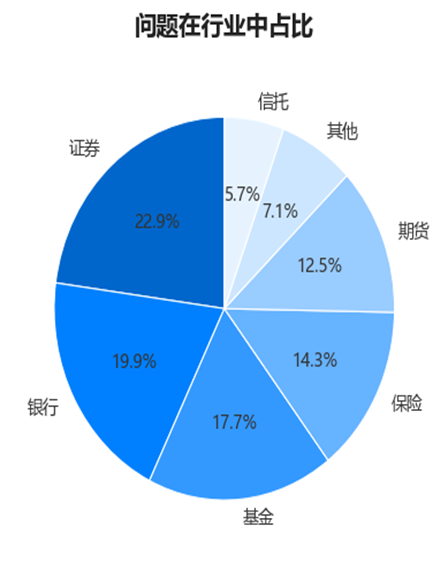
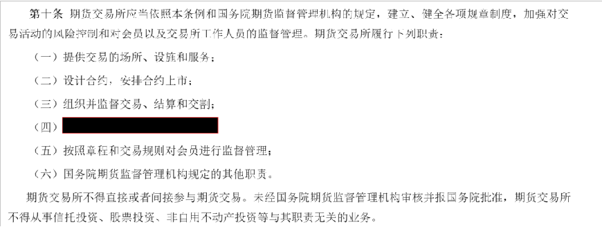
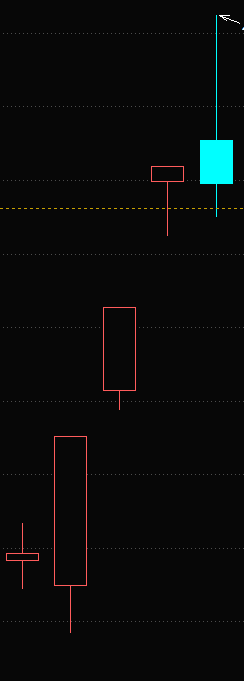
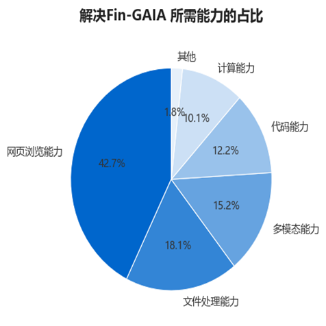
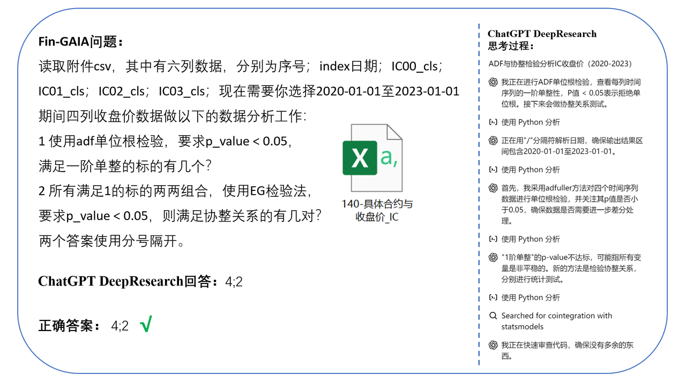
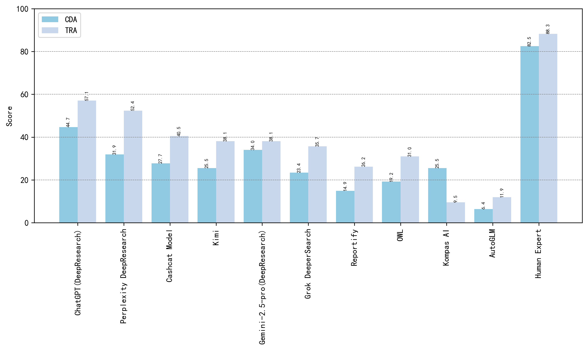
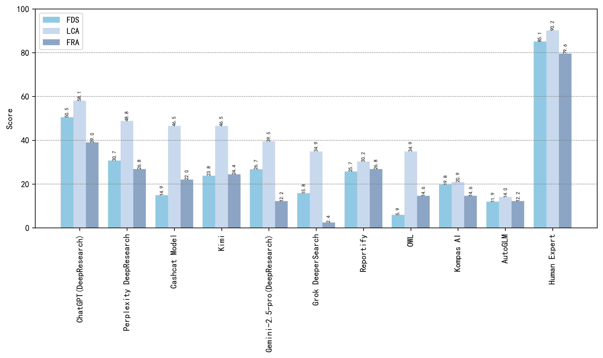
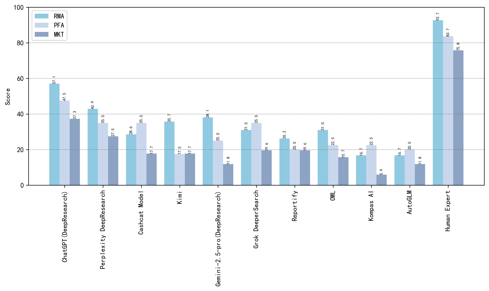

<div align="center">
   <h1>FinGAIA: The First AI Agent Evaluation Benchmark in the Financial Domain</h1>
  
                                                                                                              

[📃Paper]()
[🌐Data](https://huggingface.co/datasets/SUFE-AIFLM-Lab/FinGAIA)

[简体中文](./README.md) | [English](./README_EN.md) 
</div>


The vigorous development of AI Agents brings unprecedented opportunities for automating complex tasks in various fields, but their multi-step, multi-tool collaboration capabilities in the financial domain have yet to be explored. This paper introduces FinGAIA, the first end-to-end Agent evaluation benchmark specifically tailored for financial scenarios, filling the current gap and laying a solid foundation for promoting the development of financial AI Agents. FinGAIA is designed with highly还原 financial business scenarios as its core, comprehensively covering tasks from basic business understanding to complex strategy formulation. It contains 407 questions entirely manually written under the guidance of financial domain experts, covering seven major financial sub-fields: securities, funds, banking, insurance, futures, trusts, and asset management. These tasks are organized into three hierarchical scenario depths: basic business analysis, asset decision support, and strategic risk management, focusing on evaluating the comprehensive capabilities of intelligent agents in financial context understanding, data integration and analysis, tool collaborative calling, and multi-step reasoning, systematically measuring the agents' task execution capabilities and professional performance in real financial business processes. We evaluated 12 current mainstream AI Agents in a zero-shot setting. The best-performing Agent, ChatGPT, achieved an overall accuracy of 48.9%, which, while superior to non-professionals, still lagged behind financial experts by more than 35 percentage points.

---
# 📌 Table of Contents <a name="toc"></a>
## FinGAIA
- [Why FinGAIA is Needed](#why)
- [Scenario Applications](#application)
  - [Customer Data Analytics](#cda)
  - [Transaction Risk Assessment](#tra)
  - [Financial Data Statistics](#fds)
  - [Loan Credit Analysis](#lca)
  - [Fraud Detection Analysis](#fda)
  - [Risk Management Analysis](#rma)
  - [Portfolio Fund Allocation](#pfa)
  - [Market Trend Forecasting](#mkt)
## Performance Evaluation
- [Core Capability Assessment](#cca)
- [Leaderboard](#lb)
## Usage Guide
- [Future Outlook](#future)
- [Contact Us](#connection)
- [Citation](#cite)


## FinGAIA
### 💡 Why FinGAIA is Needed <a name="why"></a> 
For a long time, AI evaluation has been largely confined to isolated knowledge question-answering, which hardly reflects its application potential in actual financial industry work. The complexity of financial business lies in the fact that it is not a simple question-and-answer, but a complete closed loop involving "**information acquisition, data processing, analytical reasoning, and decision-making**." Existing evaluation benchmarks have obvious limitations:
* **Lack of Domain Specificity in General Agent Benchmarks**: Mainstream benchmarks like GAIA and AgentBench lack consideration for the professionalism, data dynamism, and strong compliance constraints of the financial domain.
* **Limitations of Task Singularity in Financial Domain Benchmarks**: Benchmarks such as Fin-Eval and FinQA are mostly limited to basic levels like Q&A and knowledge understanding, making it difficult to test AI's complex multi-step planning and tool collaboration capabilities in real financial workflows.
* **Absence of End-to-End Agent Framework Evaluation**: Existing research mostly focuses on the performance of underlying large models or single plugins, lacking a systematic evaluation of the overall performance of a complete AI Agent framework in business processes.
To address these challenges, Fin-GAIA is designed to build a three-level layered capability evaluation system, covering three difficulty levels and eight typical financial business scenarios, corresponding to the agent's capability requirements at basic understanding, analytical decision-making, and strategic reasoning levels, respectively.

### 🔬 Scenario Applications <a name="application"></a> 
FinGAIA comprises 407 tasks, covering seven major financial sub-fields: securities, funds, banking, insurance, futures, trusts, and asset management, ensuring comprehensiveness of the evaluation. These tasks are designed based on extensive discussions with financial domain experts and constructed from real-world financial data, undergoing professional screening and structured processing to ensure their authenticity, relevance, and evaluation effectiveness.
<div align="left">
  
  <br />
  <br /></div>

| Scenario Depth        | Financial Scenario                  | Questions |
|-----------------------|-------------------------------------|-----------|
| Operational Analytics |   Customer Data Analytics           | 47        |
|                       |   Transaction Risk Assessment       | 42        |
|                       |   All                               | 89        |
| Asset Decision        |   Financial Data Statistics         | 101       |
|                       |   Loan Credit Analysis              | 43        |
|                       |   Fraud Detection Analysis          | 41        |
|                       |   All                               | 185       |
| Strategic Risk        |   Risk Management Analysis          | 42        |
|                       |   Portfolio Fund Allocation         | 40        |
|                       |   Market Trend Forecasting          | 51        |
|                       |   All                               | 133       |
| **FinGAIA** | **All** | **407** |

We adopt a layered evaluation framework, dividing tasks into basic business analysis, asset decision support, and strategic risk management, corresponding to different cognitive complexity and operational requirements.
Level 1: Basic Business Analysis Layer, focusing on evaluating the agent's ability to process basic financial knowledge and multi-modal financial information;
Level 2: Asset Decision Support Layer, focusing on information integration, logical reasoning, and tool usage for tasks of moderate complexity;
Level 3: Strategic Risk Management Layer, for high-complexity, multi-tool collaboration, and strategy planning tasks, comprehensively assessing the model's reasoning capabilities and professionalism in real financial contexts. (Financial sub-domains + Eight scenario examples)

#### Customer Data Analytics <a name="cda"></a>
Customer Data Analytics primarily involves reviewing customer information to understand their data. The core of this work is to identify patterns and insights that inform targeted marketing strategies, product development, and personalized customer experiences. Through this analysis, financial institutions can optimize their offerings and build stronger customer relationships. Below is an example of a customer data analytics task:
<div align="center">
  
  <br />
  <br /></div>

```text
Question: 识别附件中的图片，这是一家期货公司的图标。访问其官网。在"营业机构模块"搜索：河北省沧州市营业网点的负责人是谁？
Answer: 冷俊杰
Solution Steps: 1. Identify the attached image. 2. Recognize the image as CITIC Jiantou Futures logo. 3. Visit the official website. 4. Enter the business outlets module. 5. Filter for target information. 6. Find the name of the person in charge.
```

#### Transaction Risk Assessment <a name="tra"></a>
Transaction Risk Assessment focuses on identifying and evaluating potential risks associated with financial transactions. This includes analyzing the likelihood of default, fraud, or other financial losses. The objective of this work is to mitigate risks by implementing appropriate controls and making informed decisions on transaction approvals.
<div align="center">
  
  <br />
  <br /></div>

```text
问题：小明有一张截图关于期货交易管理条例（2017年修订）得部分内容，但是由于部分内容被遮挡，他想知道被遮挡得内容是什么？你可以在中国期货业协会官网找到相关文件。
答案：为期货交易提供集中履约担保
Solution Steps: 1. Search for Fund Wikipedia. 2. Click to enter the official website. 3. Click historical versions. 4. Find March 3, 2014, click. 5. Find the corresponding fourth fund category: Securities Investment Funds. 6. Click to enter the entry. 7. Click historical versions. 8. Confirm time. 9. Check how many categories it is divided into by investment target, found 8 categories.
```

#### Financial Data Statistics <a name="fds"></a>
Financial Data Statistics involves collecting, organizing, and interpreting numerical financial information. The main task is to derive meaningful insights and trends from large datasets using statistical methods. This work supports reporting, forecasting, and identifying anomalies within financial operations.
<div align="center">
  
  <br />
  <br /></div>

```text
问题：附件中是某个德国保险公司的标志，在其官网上有2024年9月停售的“XX安享稳盈终身寿险”（XX为公司名称），通过python读取该产品费率表数据，计算该表中每一列数据（年龄列不参与计算）的变异系数（标准差 / 均值），告诉我变异系数从大到小，排名第三的是哪一列数据，回答格式如：保险类型A型；男性；趸交。
答案：保险类型B型；男性；趸交
Solution Steps: 1. View the image, found Allianz Life. 2. Search Allianz Life. 3. Click to enter the official website. 4. Click Information Disclosure - Product Basic Information. 5. Click Discontinued. 6. Search for "Allianz Anxiang Wenying Whole Life Insurance". 7. Click Product Premium Rate Table to view the corresponding data. 8. Read as df, calculate indicators. 9. Program to solve for Insurance Type B; Male; Single Premium.
```

#### Loan Credit Analysis <a name="lca"></a>
Loan Credit Analysis is the process of assessing the creditworthiness of loan applicants. It involves evaluating financial statements, credit history, and other relevant factors to determine the likelihood of repayment. The goal is to make informed lending decisions that balance risk and potential returns.
```text
问题：小明有一个课堂练习需要你的帮助来进行核验，小明模拟是上市公司（证券代码为：000001）的一名员工，他需要代表公司向某银行申请经营贷款，在他提交的材料中涉及以下内容：
1 本公司2024年股东权益为1,304,712百万元，较年初变化6.2%
2 本公司归属于母公司股东的净利润在2024年第一季度小于2024年第四季度
3 本公司第八大股东是深业集团有限公司，并且该股东在报告期内增持股票
4 本公司签字会计师有两位，姓名是：吴翠蓉，范玉军
请基于上市公司（证券代码为：000001）公布的2024年度报告，对小明材料中的信息进行核验，无法确认正确的材料均认为有误，如果有多个信息有误，则返回有问题材料的编号，使用分号隔开；如果所有信息正确无误，则返回0。
答案：2;3
Solution Steps: 1. Obtain stock data through Python code. 2. Obtain daily data of Merchants Securities from December 2, 2024 to February 5, 2024. 3. Draw K-line chart and plot 5-day and 10-day moving averages. 4. Observe the number of golden crosses generated by the moving averages.
```

#### Fraud Detection Analysis <a name="fda"></a>
Fraud Detection Analysis focuses on identifying and preventing fraudulent activities within financial systems. This includes analyzing transaction patterns and anomalies to flag suspicious behavior. The goal of this work is to protect institutions and their clients from financial crimes and losses.
```text
问题：请基于附件音频内容（当日早新闻回放），按照以下顺序分析：
1 新闻中提及的"公司动向"涉及的所有企业；
2 仅保留上市公司，过滤未上市主体；
3 对比各上市公司对应证券的当日涨幅（以该音频中播报时间为标准）；
4 输出最高涨幅证券的6位数字代码。
答案：300750
Solution Steps: 1. Visit the Shenzhen Stock Exchange website. 2. Click Market Data. 3. Click Stock Data. 4. Click Indicator Ranking. 5. Select date April 1, 2025, and click query. 6. Parse table information. 7. Find the third-ranked data. 8. Return the correct answer based on the data: Shenwan Hongyuan.
```

#### Risk Management Analysis <a name="rma"></a>
Risk Management Analysis is a broad discipline focused on identifying, assessing, and mitigating various financial risks. This work involves developing strategies and controls to minimize potential negative impacts on an institution's financial health.
```text
问题：请你通过一段Python代码，使用akshare库获取沪深300、香港恒生指数和标普500指数的历史日线数据，计算这三个指数在2014年3月1日到2024年3月1日之间的最大回撤（Drawdown）。通过使用 cummax() 函数计算每个交易日的历史最高点，再计算每个交易日的回撤率，最终得到最大回撤值并输出（按照沪深300，香港恒生指数，标普500指数顺序输出结果，两个结果之间用逗号间隔，每个结果保留两位小数，不需要输出具体的代码，只需要输出最后三个指数的最大回撤的保留两位小数的具体值）。
答案：46.70%,55.70%,33.92%
Solution Steps: 1. Search for China Financial Futures Exchange. 2. Click to enter the official website of China Financial Futures Exchange. 3. Click Data - Daily Statistics. 4. Switch time to October 9, 2024. 5. Calculate TS2412: (102.260-102.146)/102.146=0.001116. 6. Calculate TF2412: (104.525-104.220)/104.220=0.0029265. 7. Calculate T2412: (105.670-105.265)/105.265=0.003847. 8. Calculate TL2412: (111.700-110.690)/110.690=0.0091246. 9. Clarify TL2412. 10. Click Trading Position Ranking; TL; October 9, 2024. 11. Among the top 20 clients in terms of long positions, the largest change from the previous day was 572, and CITIC Futures ranked 3rd. 12. Answer TL2412;3.
```

#### Portfolio Fund Allocation <a name="pfa"></a>
Portfolio Fund Allocation involves strategically distributing capital among different assets within an investment portfolio. The primary task is to optimize the portfolio's risk-return profile based on investment objectives and market conditions. This ensures efficient capital utilization, thereby maximizing returns while managing acceptable levels of risk.
<div align="center">
  
  <br />
  <br /></div>

```text
问题：X为图片中动物的种类数目，在2021.04.01-2022.04.01期间，跌幅排名第X的基金在2021年持仓中，占净值比例最高的证券代码是多少？只回答证券代码中数字部分即可。
答案：3690
Solution Steps: 1. Open the official website of the Asset Management Association of China. 2. Go to Statistical Data. 3. Go to Private Funds to view the report for the tenth issue of 2023. 4. Find the specified chart in the report. 5. Identify the specified content and calculate 14503-12970=1533.
```

#### Market Trend Forecasting <a name="mkt"></a>
Market Trend Forecasting focuses on predicting future movements and directions in financial markets. This includes analyzing historical data, economic indicators, and various other factors to anticipate market changes. The goal of this work is to provide valuable insights for investment decisions, trading strategies, and risk management.
<div align="center">
  
  <br />
  <br /></div>

```text
问题：问题：如图是东方财富中一支股票某5个交易日的涨跌情况，其中红色空心为涨，实心青色为跌，以该证券这五个交易日涨跌规律为标准，以下五支证券：000001，000002，000004，000006，000007 在2025年2月5日至2025年2月11日（包含2月11日在内共5个交易日）涨跌分布与图片中证券中一致的是哪些证券？回答6位数证券代码，若多个证券符合要求则全部回答使用分号隔开。
答案：000004;000006
Solution Steps: 1. Search Eastmoney.com. 2. Open Eastmoney.com. 3. Navigate to Data Center - Dragon Tiger List on the homepage and click. 4. Select the date August 16, 2024. 5. Find the top-ranked stock, Shenzhen Huaqiang. 6. Calculate CCI by calling the akshare library in Python. 7. Then calculate the duration for which CCI is less than -100.
```

## 🏆 Performance Evaluation 
### Core Capability Assessment <a name="cca"></a>
FinGAIA systematically integrates industry knowledge, tool utilization, and task complexity as three core dimensions, covering the entire financial workflow from basic information retrieval, multimodal document analysis, to code-based computation and coordinated multi-tool, multi-step decision-making. Solving Fin-GAIA tasks requires AI agents to possess and coordinate various underlying capabilities.

<div align="center">
  
  <br />
  <br /></div>

* **Web Browse Capability (42.7%)**: Searching and Browse websites to obtain real-time information.
* **File Processing Capability (18.1%)**：Processing documents in various formats such as PDF, CSV, XLSX.
* **Multimodal Capability (15.2%)**：Understanding and analyzing non-textual data such as images, charts, audio, and video.
* **Coding Capability (12.2%)**：Executing code like Python to perform data analysis, model calculations, and other tasks.
* **Computational Capability (10.1%)**：Performing algebraic operations.

### Leaderboard <a name="lb"></a>
We evaluated multiple mainstream closed-source and open-source AI Agent frameworks, and the results show a clear tiered differentiation in the performance of financial AI agents across different scenarios. ChatGPT (DeepResearch) ranks first with an average score (WA) of 48.9, demonstrating excellent cross-level stability, especially outstanding performance in the Loan Credit Analysis (58.1 points) within the strategic planning scenario. The second tier, such as Perplexity DeepResearch (WA 37.0), achieved an average score of 51.6 in the Transaction Risk Assessment (TRA) scenario at the basic business layer, significantly exceeding the industry average of 14.7. Although ChatGPT (Deep Research) achieved the highest accuracy (48.9%) in this evaluation, this score is far below human experts' scores, especially in the performance of Level 3 complex problems, where agents' scores are generally low, showing the current large models' shortcomings in complex reasoning and deep understanding tasks. This also indicates that although existing agents have made significant breakthroughs in relatively simple or moderately complex problems, there is still much room for improvement in model performance when facing more challenging high-difficulty problems. Future research and development will need to further strengthen these models' reasoning capabilities, problem-solving depth, and understanding of complex situations. The specific evaluation results are as follows:

| Agent                          | CDA                   | TRA   | FDS            | LCA   | FRA   | RMA            | PFA   | MKT   |WA     |
|--------------------------------|-----------------------|-------|----------------|-------|-------|----------------|-------|-------|-------|
| ChatGPT(DeepResearch)          | 44.7                  | 57.1  | 50.5           | 58.1  | 39.0  | 57.1           | 47.5  | 37.3  | 48.9  |
| Perplexity DeepResearch        | 31.9                  | 52.4  | 30.7           | 48.8  | 26.8  | 42.9           | 35.0  | 27.5  | 37.0  |
| Cashcat DeepResearch           | 29.8                  | 52.4  | 21.8           | 48.8  | 31.7  | 26.2           | 35.0  | 19.6  | 33.2  |
| Kimi                           | 25.5                  | 38.1  | 23.8           | 46.5  | 24.4  | 35.7           | 17.5  | 17.7  | 28.6  |
| Gemini-2.5-pro(DeepResearch)   | 34.0                  | 38.1  | 26.7           | 39.5  | 12.2  | 38.1           | 25.0  | 11.8  | 28.2  |
| Grok DeeperSearch              | 23.4                  | 35.7  | 15.8           | 34.9  | 2.4   | 31.0           | 35.0  | 19.6  | 24.7  |
| Reportify                      | 14.9                  | 26.2  | 25.7           | 30.2  | 26.8  | 26.2           | 20.0  | 19.6  | 23.7  |
| OWL                            | 19.2                  | 31.0  | 5.9            | 34.9  | 14.6  | 31.0           | 22.5  | 15.7  | 21.8  |
| Kompas AI                      | 25.5                  | 9.5   | 19.8           | 20.9  | 14.6  | 16.7           | 22.5  | 5.9   | 16.9  |
| AutoGLM                        | 6.4                   | 11.9  | 11.9           | 14.0  | 12.2  | 16.7           | 20.0  | 11.8  | 13.1  |
| Avg. Score                     | 25.5                  | 35.2  | 23.2           | 37.7  | 20.5  | 32.2           | 28.0  | 18.7  | -     |
| Human Expert                   | 82.5                  | 88.3  | 85.1           | 90.2  | 79.6  | 92.7           | 83.7  | 75.8  | 84.7  |


**A more specific evaluation example:** This example clearly demonstrates how a typical FinGAIA problem requires the agent to first understand and process a local CSV file, then call code (Python) to perform specific statistical tests (ADF test and EG cointegration test), and finally derive two independent numerical answers. It examines the comprehensive capabilities of file processing, code execution, and logical reasoning.

<div align="center">
  
  <br />
  <br /></div>

The basic business analysis scenario evaluates the performance of Agent intelligent agents in two basic financial operational tasks: Customer Data Analytics (CDA) and Transaction Risk Assessment (TRA). The figure below shows that human experts achieved 82.5 and 88.3 points in CDA and TRA respectively, demonstrating stable professional proficiency. In contrast, the best-performing ChatGPT (DeepResearch) achieved 57.1 points in TRA, showing a clear gap in basic operational tasks. It is particularly noteworthy that all tested agents performed weaker in TRA tasks requiring multi-system collaboration, with AutoGLM scoring only 6.4 points in CDA, reflecting the current agent architecture's shortcomings in cross-system collaboration. The average score of the Top 3 Agents was 45.1 points, reaching 4.8 times that of the Bottom 3, this significant stratification highlights the difference in agent tool usage efficiency, and this polarization phenomenon indicates that agents exhibit a capability stratification effect, highlighting the importance of specialized model optimization.
<div align="center">
  
  <br />
  <br /></div>

In asset decision support, the figure below shows performance in three decision tasks: Financial Data Statistics (FDS), Loan Credit Analysis (LCA), and Fraud Detection Analysis (FRA). Human experts maintain overall leadership with an average of 86.7 points, while the best-performing ChatGPT Agent achieved 49.2 points, with a relatively prominent performance in Loan Credit Analysis (LCA 58.1 points). Each Agent showed distinct specialization characteristics: Perplexity DeepResearch performed better in data statistics (FDS 30.7 points), while Cashcat DeepResearch had a slight advantage in fraud detection (FRA 31.7 points). This specialization phenomenon indicates that a single Agent cannot cover all decision-making needs, and specialized division of labor and collaboration may be a more feasible application path.
<div align="center">
  
  <br />
  <br /></div>
  
Under the strategic risk management scenario, three key financial scenarios are covered: Risk Management Analysis (RMA), Portfolio Fund Allocation (PFA), and Market Trend Forecasting (MTF). As shown in the data below, human experts scored an average of 84.0 points in the three sub-tasks, significantly leading the best-performing AI agent ChatGPT (DeepResearch) with 41.5 points. It is noteworthy that AI agents performed weakest in PFA tasks, with an average score of only 29.2 points, reflecting the current models' clear shortcomings in asset allocation decisions, a complex task requiring comprehensive consideration of multiple risk factors.
<div align="center">
  
  <br />
  <br /></div>


## 🚀 Future Outlook <a name="future"></a> 

The test results of Fin-GAIA send a clear signal: for the financial industry, simply improving the knowledge base of large language models is no longer enough. How to enable models to learn to skillfully and collaboratively use various analytical tools, like humans, is the key to determining whether they can become reliable productivity.
We plan to:

**Open Dataset:** Release 150 annotated developer problem sets.

**Maintain Leaderboard:** Continuously track and display the performance of top AI agents in the financial domain in the form of a leaderboard.

The list will be updated regularly to include more available agents. Individuals and organizations interested in agent evaluation are welcome to contact and exchange ideas.

## 📫 Contact Us <a name="connection"></a>
We sincerely invite colleagues from the industry to jointly explore innovative paradigms for the deep integration of AI and finance, build a new ecosystem of intelligent finance, and contact us via email at zhang.liwen@shufe.edu.cn.

## 📚 Citation <a name="cite"></a> 

If you use Fin-GAIA in your research, please cite our paper.

```bibtex
@article{Fin-GAIA,
  title={Fin-GAIA：A Benchmark for Evaluating AI Agents in the Financial Domain},
  author={Fin-GAIA Team},
  year={2024},
  journal={arXiv preprint}
}
```
